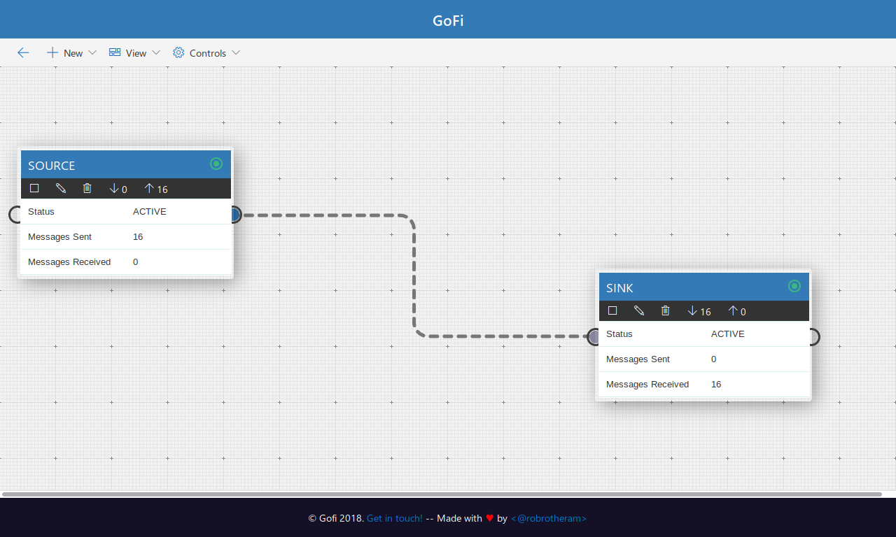

# Gofi a node base programming system
gofi is my personal experiment at building a flow/node base programming system inspired by apache nifi
Note The system is very expermental, I am no way near a go expert so many things done in this project could be done in many better ways.

#### Demo
You can see a basic demo here https://robrotheram.com/gofi.mp4
In the demo you can see 3 nodes. 1 that generates random data. The second using GRPC sends it to a jypter notebook to calculate the factors. The last node then prints it out

### Screenshots

### The features that this currently supports:
- Leader election using ectd. The leader can then orchestrate running processes agross several worker nodes. New nodes can be dynamically added to the custer and processes not currently running will be scheduled to run to the new nodes. If a node dies their work should move onto the running nodes.
- Ui: Custom UI that allows you to add new proccess. Ui can be found here https://github.com/robrotheram/gofiUI

### Future work I like to add to the project:
- [ ] Testing Both unit and integration
- [ ] CI/CD
- [ ] New workers can have different types of jobs. Eg a dedicated ML worker
- [ ] GRPC to communicate with other languages / Lecacy code
- [ ] Plugins support ?

### Technology:
This project uses the following core libaraies/services. All is likely to change if something better can be found
- Badgerdb for K/V data store. Used for local data (such as the graph storage) https://github.com/dgraph-io/badger
- Ectd distributed  K/V system. Currenltly used for leader election https://coreos.com/etcd/
- NSQ realtime distributed messaging platform (kafka esq but all in go). Core for how messages go between processes and workers chosed

### Terminology:
- Graph: A list of nodes and the connections between nodes.
- Node: A singular process contains the paramaters of that process and metadata. metadata will inculde things like x,y position in the ui
- Connection: Descripes what the output from one node feeds into
- Proccess: Unit of work that gets scheduled on a worker. Uses the data in the nodes as well as the connection information to work out the topics to send data to or listen to.
Topic: A stream of data in NSQ.
- Pipeline: Object that does the work and is what the process will create. There are different types of pipelines. The most basic is the source pipeline that will just send a test message once a second. Or the sink pipeline that will just print to std out any data on the topic.
- Worker, A server that will run the processes.

